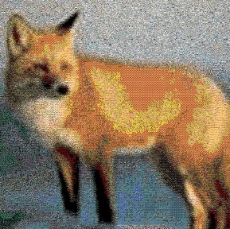

# PyMosaic
A python script for generating mosaic art.

## Requirements
- [Pillow](https://github.com/python-pillow/Pillow)
- [tqdm](https://github.com/tqdm/tqdm) (progress bar)

## Usage
- edit `settings.py`
- run `python main.py`

## Example
> ### input file
> 

> ### output file
> [download full image here (~95MB)](https://cdn.discordapp.com/attachments/789490795903844382/934748291713875978/output.jpeg)
> 
> 